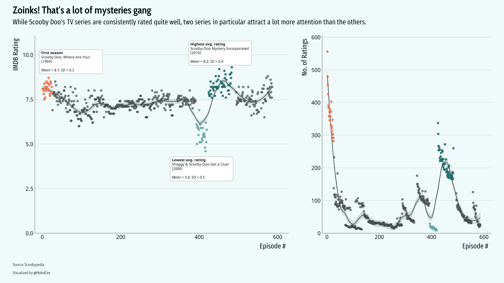

# TidyTuesday
A repository for any and all #TidyTuesday work

## 2020-08-18: Extinct Plants

This animation didn't do as I had hoped. The time variable is a little fuzzy (the last decade a plant species was seen), and the threats were not necessarily tied to that time period so the best interpretation I think we can make is that the threats are prevalent for species that went extinct in a given decade. I did however get to experiment with font styles, animating a bar chart with **{gganimate}**, adding HTML styling to text through **{ggtext}**, and creating colour palettes which are simple but effective.

Next time I want to focus on making intuitive visualizations, and perhaps joining a few together with **{patchwork}**

## 2021-07-13: Scooby Doo

After a *short* hiatus, and many half-finished visualizations, I got back to solving mysteries with data and who better to do that with than Scooby Doo himself. 
This plot looks at the admirably consistent ratings of Scooby Doo's 50 years on television screens. 
I was a little suspicious and found that there is a good 30-40 year chunk of Scooby's repertoire that have very few IMDB ratings in comparison to his more popular seasons. 
It would have been very interesting to see if the reviewers were the same people throughout the less popular series or if it still a varying group of Scooby Doo fans. Alas, that wasn't in the data.
