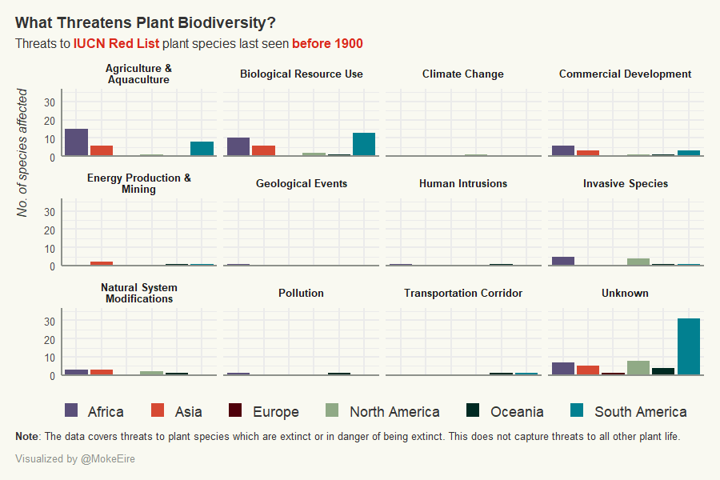

# TidyTuesday
A repository for any and all #TidyTuesday work

## 2020-08-18: Extinct Plants

This animation didn't do as I had hoped. The time variable is a little fuzzy (the last decade a plant species was seen), and the threats were not necessarily tied to that time period so the best interpretation I think we can make is that the threats are prevalent for species that went extinct in a given decade. I did however get to experiment with font styles, animating a bar chart with **{gganimate}**, adding HTML styling to text through **{ggtext}**, and creating colour palettes which are simple but effective.

Next time I want to focus on making intuitive visualizations, and perhaps joining a few together with **{patchwork}**
